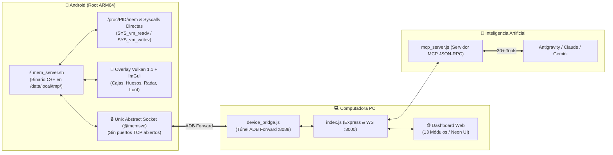

<div align="center">

# 🚀 LINX_MCP_LECTOR
### External Stealth Android Memory Bridge, Native Vulkan Overlay & AI MCP Controller

[](https://opensource.org/licenses/MIT)
[-3DDC84.svg?logo=android&logoColor=white)](https://github.com/)
[](https://github.com/)
[](https://modelcontextprotocol.io/)
[](https://github.com/)
[](https://uam.lol/j)

**Una solución Open Source integral de lectura e inspección de memoria externa (Zero-Injection) para Android ARM64, con renderizado acelerado por Vulkan 1.1 + ImGui, Dashboard Web interactivo y servidor de Inteligencia Artificial (MCP) para Antigravity IDE, Claude, Gemini y GPT.**

[🌐 Ver Web de Presentación](web/index.html) • [📚 Manual MCP para IA](docs/AI_MCP_MANUAL.md) • [🏛️ Arquitectura](docs/ARCHITECTURE.md) • [🧭 Guía de Offsets](docs/UE4_OFFSETS_GUIDE.md) • [🛠️ Compilación](docs/BUILD_AND_INSTALL.md)

</div>

---

## 🌟 ¿Por qué es Open Source este proyecto?

Este proyecto fue desarrollado originalmente como un puente avanzado de memoria externa e integración con Inteligencias Artificiales para juegos basados en **Unreal Engine 4** (*Arena Breakout Lite / Standard*).

Se libera de forma **100% libre y Open Source** para que cualquier desarrollador, estudiante o investigador de ingeniería inversa pueda:
* Aprender cómo interactuar con `/proc/<pid>/mem` y syscalls ARM64 sin inyección de librerías ni ganchos (hooks) detectables.
* Entender la creación de interfaces gráficas nativas con **Vulkan + ImGui** directamente sobre la superficie del compositor de Android.
* Integrar modelos de lenguaje avanzados (LLMs) mediante el **Model Context Protocol (MCP)** para que una IA analice la memoria de un videojuego en tiempo real.
* Continuar y perfeccionar la calibración de matrices de cámara, algoritmos World-to-Screen y offsets de nuevas versiones.

---

## 🏗️ Arquitectura del Sistema



---

## ✨ Características Principales

| Módulo | Capacidades |
|---|---|
| 📱 **Zero-Injection Daemon** | Lectura ultra-rápida por `/proc/<PID>/mem` y syscalls ARM64 (270/271). Cero inyección de `.so`. Nombre de proceso camuflado como `kworker`. Socket abstracto `@memsvc` indetectable por escaneo TCP. |
| 🎨 **Native Vulkan Overlay** | HUD en pantalla a 120 FPS: Cajas delimitadoras 2D/3D, esqueleto anatómico completo (`BoneList`), distancias, vida, arma, mini-radar 2D y filtro de loot con precio mínimo. |
| 💻 **Web UI Dashboard (13 Pestañas)** | Dashboard interactivo con telemetría en tiempo real, visor de procesos, módulos `.so`, mapa de entidades 3D, editor hexadecimal, desensamblador, escáner de firmas AOB y gestor de archivos remoto. |
| 🤖 **Servidor MCP para IA** | Más de 30 herramientas estandarizadas JSON-RPC para que asistentes IA puedan leer jugadores, diagnosticar componentes (`mem_inspect_actor`), hacer Hot-Tuning de offsets (`mem_set_ue4_config`) y aplicar parches con rollback. |
| 🔬 **Reconstructor de ELF** | Módulo `elf_fixer.cpp` para volcar `libUE4.so` descifrada desde la RAM y reparar sus cabeceras para análisis en **IDA Pro** o **Ghidra**. |
| ⚡ **Hot-Reloading** | Actualización en caliente del binario en el móvil sin necesidad de cerrar el juego ni reiniciar la partida. |

---

## 🚀 Inicio Rápido (3 Pasos)

### 1️⃣ Celular (Android Root): 1 Solo Archivo
1. Descarga o compila el binario único [`android_server/libs/arm64-v8a/mem_server.sh`](android_server/build.bat).
2. Cópialo a tu celular en `/data/local/tmp/mem_server.sh`.
3. En **MT Manager**, dale permisos **`777`** (`rwxrwxrwx`), tócalo y presiona **Ejecutar** (con Root).

### 2️⃣ Computadora (PC): Cliente Web
1. Abre una terminal en `pc_client/` y ejecuta `npm install` (solo la primera vez).
2. Haz doble clic en [`pc_client/start_client.bat`](pc_client/start_client.bat).
3. Tu navegador se abrirá automáticamente en:
   👉 **`http://localhost:3000`**

### 3️⃣ Inteligencia Artificial (MCP en Antigravity / Claude)
Añade esto a tu archivo `mcp_config.json`:
```json
{
  "mcpServers": {
    "linx-memory": {
      "command": "node",
      "args": [
        "C:\\Users\\Usuario\\Documents\\C\\AB\\LINX_MCP_LECTOR\\pc_client\\server\\mcp_server.js"
      ]
    }
  }
}
```

---

## 🛠️ Catálogo Resumido de Herramientas MCP

```text
mem_status              ➔ Estado de conexión, juego y PID vinculado
mem_attach              ➔ Vincula a paquete o PID específico
mem_ue4_roots           ➔ Resuelve lib_base, FNamePool, GUObjectArray y GWorld
mem_get_world_actors    ➔ Extrae jugadores, bots y coordenadas 3D en vivo
mem_inspect_actor       ➔ Diagnóstico profundo de Mesh, Huesos, Componentes y Posición
mem_set_ue4_config      ➔ Calibración en caliente de offsets (cámara, actores, mesh, root)
mem_set_draw_config     ➔ Control en vivo del Overlay ESP (box, skeleton, radar, loot)
mem_read_hex / types    ➔ Lectura formateada de memoria (float, vec3, int32, string)
mem_patch / restore     ➔ Parches ARM64 con copia de seguridad y reversión instantánea
mem_dump_fixed_elf      ➔ Vuelca y repara libUE4.so para IDA Pro / Ghidra
```
*(Consulta [`docs/AI_MCP_MANUAL.md`](docs/AI_MCP_MANUAL.md) para la lista completa de más de 30 herramientas)*.

---

## 🤝 Cómo Contribuir

Las contribuciones son bienvenidas. Si tienes mejoras para:
* Actualizar offsets de nuevas versiones de Arena Breakout.
* Mejorar la proyección WorldToScreen y suavizado de cámara.
* Agregar visualizadores 3D en la Web UI.

Revisa la [Guía de Contribución](CONTRIBUTING.md) y envía tu Pull Request.

---

## 📜 Licencia y Comunidad

Este proyecto está bajo la Licencia **[MIT](LICENSE)**.

* 🌐 Sitio Web y Comunidad: **[uam.lol/j](https://uam.lol/j)**
* 📢 Únete a la conversación y comparte tus mejoras para que el proyecto siga creciendo.
