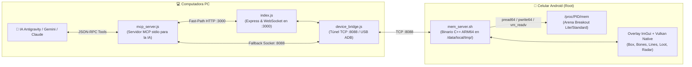

# 🤖 Manual y Protocolo MCP de Memoria Android (Unreal Engine 4 & Arena Breakout)

> **LINX_MCP_LECTOR — Powered by [uam.lol/j](https://uam.lol/j)**

Este documento es la **guía maestra y protocolo de ejecución** para Inteligencias Artificiales (Antigravity IDE, Claude, Gemini, GPT) y desarrolladores al operar el sistema de lectura, inspección, diagnóstico, edición y renderizado de memoria en tiempo real para Android ARM64 (Arena Breakout Lite / Standard).

---

## 🏗️ 1. Arquitectura del Sistema



* **Binario en Celular**: `mem_server.sh` es un ejecutable ELF nativo compilado en C++ (nombrado `.sh` para ejecución directa en MT Manager con permisos `777`). Escucha en el socket `@memsvc`.
* **Zero Inyección / Stealth**: No inyecta librerías `.so`. Lee y escribe en la RAM mediante `/proc/<pid>/mem` y `process_vm_readv` / `process_vm_writev` de forma externa e invisible para anti-cheats basados en hooks.
* **Auto-Vinculación**: El servidor detecta automáticamente si `com.proximabeta.mf.liteuamo` o `com.proximabeta.mf.uamo` está corriendo y lo vincula al instante.
* **Hot-Reload / Actualización en Vivo**: Permite reemplazar el binario del celular en caliente (`mem_push_auto_update`) sin cerrar el juego ni desconectar el socket.

---

## 🎮 2. Protocolos de Ejecución para la IA

### 🎯 Protocolo A: Cuando el Usuario Dice "ESTOY EN PARTIDA"
Cuando el usuario indique que está en partida (ej. *"estoy en partida"*, *"partida 4vs4"*, *"lee los jugadores"*, *"dime dónde están"*), ejecuta este flujo:

1. **Verificar Conexión y PID (`mem_status`)**:
   - Asegura `connected: true` y `attached: true` (`com.proximabeta.mf.liteuamo`).
   - Si no está vinculado: llama a `mem_attach(target: "com.proximabeta.mf.liteuamo")`.
2. **Resolver Raíces de UE4 (`mem_ue4_roots`)**:
   - Resuelve `lib_base`, `FNamePool`, `GUObjectArray` y `GWorld`.
3. **Extraer Snapshot y Jugadores (`mem_get_world_actors`)**:
   - Itera `GWorld ➔ PersistentLevel ➔ AActors`.
   - Retorna coordenadas 3D (`x`, `y`, `z`), distancia en metros, vida, equipo y nombre.
   - Si `actors: []`, el usuario está en el lobby o pantalla de carga.
4. **Si hay desalineación de cámara o actores**:
   - Consulta `mem_get_ue4_config`.
   - Ajusta offsets con `mem_set_ue4_config(key: "camera", value: "0x1100")` o `mem_set_ue4_config(key: "actors", value: "0x98")`.

---

### 🔧 Protocolo B: Hot-Tuning de Offsets en Tiempo Real
Permite a la IA y al usuario descartar y calibrar offsets de UE4 en vivo sin recompilar ni reiniciar:
1. Consultar configuración activa: `mem_get_ue4_config()`
2. Sobrescribir un offset:
   - Cámara POV: `mem_set_ue4_config(key: "camera", value: "0x1100")`
   - Array de Actores: `mem_set_ue4_config(key: "actors", value: "0x98")`
   - RootComponent / Cápsula: `mem_set_ue4_config(key: "root_comp", value: "0x158")`
   - Mesh del Jugador: `mem_set_ue4_config(key: "mesh", value: "0x370")`
   - PersistentLevel: `mem_set_ue4_config(key: "persistent_level", value: "0x30")`
   - Restablecer a valores por defecto: `mem_set_ue4_config(key: "reset", value: "0")`

---

### ✍️ Protocolo C: Escritura Tipada y Parches Seguros en RAM
Permite modificar variables en caliente o aplicar parches ARM64 con copia de seguridad instantánea:
1. **Escritura Tipada (`mem_write_typed`)**:
   - Modificar FOV / Variables float: `mem_write_typed(address: "0x...", type: "float", value: "90.0")`
   - Modificar enteros / IDs: `mem_write_typed(address: "0x...", type: "int32", value: "100")`
   - Modificar vectores 3D: `mem_write_typed(address: "0x...", type: "vec3", value: "1500.0 2400.0 120.0")`
   - Modificar cadenas de texto: `mem_write_typed(address: "0x...", type: "string", value: "NuevoNick")`
2. **Parche con Backup (`mem_patch`)**:
   - `mem_patch(address: "0x785e001234", hex_patch: "1F2003D5")` (NOP en ARM64).
   - Retorna automáticamente `orig_hex` con los bytes originales.
3. **Reversión / Rollback (`mem_restore`)**:
   - `mem_restore(address: "0x785e001234", hex_orig: "<orig_hex>")`.

---

### 🎨 Protocolo D: Control del Overlay / HUD ImGui en Vivo
Permite a la IA y al usuario controlar los elementos dibujados en pantalla del celular:
1. Consultar estado del overlay: `mem_get_draw_config()`
2. Activar / Desactivar funciones (`mem_set_draw_config`):
   - `mem_set_draw_config(key: "box", value: "1")` ➔ Cajas 2D/3D.
   - `mem_set_draw_config(key: "skeleton", value: "1")` ➔ Huesos del jugador.
   - `mem_set_draw_config(key: "snapline", value: "1")` ➔ Líneas de visión / Rayos.
   - `mem_set_draw_config(key: "distance", value: "1")` ➔ Indicador de distancia en metros.
   - `mem_set_draw_config(key: "health", value: "1")` ➔ Salud y blindaje.
   - `mem_set_draw_config(key: "weapon", value: "1")` ➔ Nombre de arma y munición.
   - `mem_set_draw_config(key: "radar", value: "1")` ➔ Mini-radar 2D.
   - `mem_set_draw_config(key: "fov_circle", value: "1")` ➔ Círculo de FOV.
   - `mem_set_draw_config(key: "ignore_bots", value: "1")` ➔ Filtrar bots para mostrar solo enemigos reales.
   - `mem_set_draw_config(key: "loot", value: "1")` ➔ Cajas fuertes, maletines e ítems.
   - `mem_set_draw_config(key: "min_loot_price", value: "5000")` ➔ Filtro de valor mínimo de loot.

---

### 🔬 Protocolo E: Diagnóstico Profundo de Actores (`mem_inspect_actor`)
Cuando se desee inspeccionar un jugador específico (`BP_UamCharacter_C` en `0x...`):
1. Ejecutar `mem_inspect_actor(actor_address: "0x7430246000")`.
2. El daemon vuelca en un único payload JSON:
   - `RootComponent` (`CollisionCylinder`): Posición XYZ y rotación Pitch/Yaw/Roll exactas.
   - `Mesh` (`CharacterMesh0`): Puntero `SkeletalMesh` y array de huesos (`BoneTransforms`).
   - `PlayerState`: Nickname del jugador, Team ID / Camp ID.
   - `Controller`: Puntero al controlador del actor.
   - `components`: Lista completa de todos los subcomponentes UObject en memoria `[0x20, 0x600]`.

---

## 🛠️ 3. Catálogo Completo de Herramientas MCP

### A. Estado y Procesos
| Herramienta | Parámetros | Uso / Propósito |
|---|---|---|
| `mem_status` | *(ninguno)* | Consulta estado de conexión, modo (USB/Wi-Fi), juego vinculado y PID. |
| `mem_attach` | `target` (string: PID o paquete) | Vincula el daemon a un juego o PID específico. |
| `mem_list_processes` | *(ninguno)* | Lista todos los procesos en ejecución en Android y detecta juegos conocidos. |
| `mem_get_modules` | *(ninguno)* | Lista módulos `.so` (`libUE4.so`, `libanogs.so`, etc.) con base y tamaño. |

### B. Motor Unreal Engine 4 (UE4) y ESP
| Herramienta | Parámetros | Uso / Propósito |
|---|---|---|
| `mem_ue4_roots` | *(ninguno)* | Obtiene `lib_base`, `FNamePool`, `GUObjectArray` y `GWorld`. |
| `mem_scan_ue4_roots` | *(ninguno)* | Escanea en tiempo real instrucciones ARM64 para hallar raíces sin offsets duros. |
| `mem_resolve_fname` | `index` (int) | Convierte un FName index a string legible. |
| `mem_get_uobject` | `index` (int) | Lee objeto y clase desde GUObjectArray. |
| `mem_get_world_actors` | `gworld_address` (opt), `limit` (opt) | **Extracción de partida**: lista jugadores, bots, loot y coordenadas 3D. |
| `mem_inspect_actor` | `actor_address` (hex) | **Radiografía de actor**: vuelca componentes, coordenadas, rotación, mesh, huesos y PlayerState. |
| `mem_get_ue4_config` | *(ninguno)* | Obtiene los offsets dinámicos activos en el daemon (cámara, PL, actores, root, mesh, huesos). |
| `mem_set_ue4_config` | `key` (str), `value` (hex/dec str) | **Hot-Tuning en vivo**: cambia cualquier offset en caliente sin recompilar (`"camera"`, `"actors"`, `"root_comp"`, `"mesh"`, `"persistent_level"`, `"bone_array"`, `"comp_to_world"` o `"reset"`). |
| `mem_get_draw_config`| *(ninguno)* | Obtiene el estado de dibujado del Overlay ESP (cajas, huesos, líneas, distancia, salud, radar, fov). |
| `mem_set_draw_config`| `key` (str), `value` (str) | **Control en vivo del Overlay**: activa/desactiva funciones visuales en tiempo real (`"box"`, `"skeleton"`, `"snapline"`, `"distance"`, `"health"`, `"radar"`, `"fov_circle"`, `"ignore_bots"`, `"loot"`, `"min_loot_price"`). |
| `mem_dump_fixed_elf` | `module` (opt), `output_path` (opt) | Vuelca y reconstruye `libUE4.so` descifrada desde RAM para abrir en IDA Pro / Ghidra. |

### C. Inspección, Edición y Parches de Memoria
| Herramienta | Parámetros | Uso / Propósito |
|---|---|---|
| `mem_read_hex` | `address` (hex), `size` (int) | Lee bytes en formato hexadecimal crudo. |
| `mem_read_types` | `address` (hex), `size` (int) | Lee y formatea como Int8/16/32/64, Float, Double, Puntero, ASCII. |
| `mem_read_pointer_chain`| `base_address` (hex), `offsets` (array) | Sigue cadenas de punteros multinivel (ej: `["0x30", "0x180"]`). |
| `mem_read_string` | `address` (hex), `max_length` (int) | Lee strings terminados en null. |
| `mem_write_hex` | `address` (hex), `hex_data` (hex string) | Escribe bytes crudos en memoria del juego. |
| `mem_write_typed` | `address` (hex), `type` (str), `value` (str) | **Escritura tipada en vivo**: escribe `float`, `double`, `int32`, `uint32`, `int64`, `vec3`, `string`, `bool` directamente. |
| `mem_patch` | `address` (hex), `hex_patch` (hex string) | Aplica parche en caliente y retorna los bytes originales automáticamente para backup. |
| `mem_restore` | `address` (hex), `hex_orig` (hex string) | Revierte y restaura los bytes originales tras un parche. |
| `mem_pattern_scan` | `pattern` (hex con `??`), `module` (opt) | Búsqueda AOB de firmas de bytes. |

### D. Archivos, Diagnóstico y Actualización
| Herramienta | Parámetros | Uso / Propósito |
|---|---|---|
| `mem_fs_list` | `path` (opt) | Lista directorios en el celular (`/data/local/tmp/`). |
| `mem_file_download` | `remote_path`, `local_path` | Descarga un archivo del celular a la PC vía streaming TCP. |
| `mem_folder_download` | `remote_folder`, `local_folder` | Comprime en el celular y descarga una carpeta completa a la PC. |
| `mem_fs_delete` | `path`, `recursive` (bool) | Elimina archivos o carpetas en el celular. |
| `mem_compress_archive` | `input_path`, `output_archive`, `format` | Comprime archivos o carpetas a ZIP/TAR en el celular. |
| `mem_decompress_archive`| `archive_path`, `output_dir` | Descomprime archivos en el celular. |
| `mem_get_device_logs` | `limit` (opt), `min_level` (opt) | Diagnóstico profundo del kernel de Android (TID, errno). |
| `mem_clear_device_logs`| *(ninguno)* | Limpia buffer de logs del celular. |
| `mem_push_auto_update` | *(ninguno)* | Aplica Hot-Reload del binario `mem_server.sh` en el celular sin reiniciar. |
| `mem_get_manual` | *(ninguno)* | Retorna este manual completo a la IA. |

---

## ⚙️ 4. Configuración en `mcp_config.json`

```json
{
  "mcpServers": {
    "linx-memory": {
      "command": "node",
      "args": [
        "C:\\Users\\Usuario\\Documents\\C\\AB\\LINX_MCP_LECTOR\\pc_client\\server\\mcp_server.js"
      ]
    }
  }
}
```

---

> Más información y actualizaciones: **[uam.lol/j](https://uam.lol/j)**
