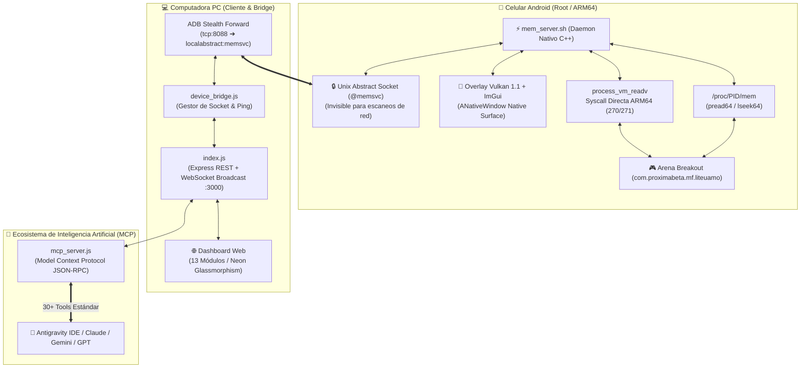

# 🏛️ Arquitectura del Sistema: LINX_MCP_LECTOR

> **Powered by: [uam.lol/j](https://uam.lol/j)**

**LINX_MCP_LECTOR** es una suite de ingeniería inversa, inspección de memoria en tiempo real y telemetría asistida por Inteligencia Artificial diseñada específicamente para juegos desarrollados en **Unreal Engine 4** en la plataforma **Android ARM64** (con foco en *Arena Breakout Lite* y *Standard*).

---

## 📐 1. Diagrama General de Capas



---

## 🛡️ 2. Mecanismos de Evasión y Stealth (Zero Injection)

A diferencia de las herramientas convencionales de modificación de juegos en Android que inyectan librerías `.so` mediante `ptrace` o `dlopen`, **LINX_MCP_LECTOR** opera completamente como un proceso externo e independiente:

| Característica | Métodos Tradicionales (Detectables) | LINX_MCP_LECTOR (Stealth) |
|---|---|---|
| **Inyección de Código** | Inyecta `.so` en el espacio de memoria del juego (Hooks inline / GOT). | **Cero Inyección**: El juego corre intacto. Memoria leída externamente desde `/proc/<pid>/mem`. |
| **Comunicaciones de Red** | Abre puertos TCP (`0.0.0.0:8088`), detectables en `/proc/net/tcp`. | **Unix Abstract Socket (`@memsvc`)**: No crea archivos en disco ni puertos TCP. |
| **Identidad del Proceso** | Nombre de binario identificable en `ps`. | **Spoofing de Nombre**: Se renombra automáticamente a `kworker/u8:2` vía `prctl(PR_SET_NAME)`. |
| **SELinux** | Requiere desactivar SELinux globalmente. | **SELinux Permissive / Enforcing Safe**: Compatible con modos estándar sin romper protecciones del kernel. |

---

## ⚡ 3. Canales de Lectura y Escritura de Memoria (`c_mem_driver`)

El núcleo en C++ implementa un sistema adaptativo de 3 niveles con fallback automático:

1. **Lectura por `/proc/<PID>/mem` (`pread64`)**:
   - Velocidad ultra-rápida.
   - Accede a los mapas de memoria virtuales directamente a través del descriptor de archivo del kernel.
2. **Syscalls Directas ARM64 (`SYS_vm_readv` = 270, `SYS_vm_writev` = 271)**:
   - Evita la capa estándar de `libc.so` ejecutando directamente la instrucción ensamblador `svc #0`.
   - Lee múltiples bloques de memoria dispersos en una sola llamada (`iovec`).
3. **Rollback Seguro de Parches**:
   - Cada escritura o parche (`cmd_patch`) almacena en un buffer circular los bytes originales para permitir reversión instantánea (`cmd_restore`).

---

## 🎨 4. Motor Gráfico Nativo (Vulkan + ImGui)

El módulo visual no utiliza capas Java ni ventanas flotantes de Android (`WindowManager`), sino que interactúa directamente con la superficie nativa del compositor gráfico:

* **`ANativeWindowCreator`**: Obtiene el descriptor de display nativo (`/dev/graphics/fb0` o `SurfaceComposer`).
* **Vulkan 1.1 Pipeline**:
  * Shaders optimizados en SPIR-V para bajo consumo de batería y tasa de refresco a 120 FPS.
  * Renderiza: Cajas delimitadoras 2D/3D, esqueleto anatómico completo (`BoneList`), rayos de distancia, indicadores de salud, armas activas y mini-radar 2D.
* **Sincronización Multihilo**:
  * Hilo 1: Bucle de renderizado Vulkan + ImGui a máxima tasa de cuadros.
  * Hilo 2: Servidor de socket TCP/Unix `@memsvc` respondiendo comandos del cliente PC o de la IA.
  * Los hilos se comunican mediante estructuras atómicas libres de bloqueo (`ESPSharedState`).

---

## 🔗 5. Puentes de Comunicación

```text
[ Móvil: @memsvc ] ──(ADB Forward)──> [ PC: 127.0.0.1:8088 ] ──> [ Node.js Bridge ] ──> [ Web UI & MCP ]
```

* **ADB Forward**: Mapea el socket abstracto del celular al puerto local `8088` de la computadora sin exponer el teléfono a la red Wi-Fi pública si se usa cable.
* **Soporte Wi-Fi**: En redes locales seguras, el daemon puede configurarse para escuchar en la IP local del dispositivo (`192.168.x.x:8088`).
* **Protocolo de Comandos**: Mensajes basados en texto con respuestas serializadas en **JSON** de alta velocidad con soporte para streaming de chunks base64.

---

> Para más detalles sobre el catálogo de herramientas y cómo interactuar con este sistema mediante Inteligencia Artificial, consulta [`AI_MCP_MANUAL.md`](AI_MCP_MANUAL.md).  
> Enlace del proyecto y comunidad: **[uam.lol/j](https://uam.lol/j)**
